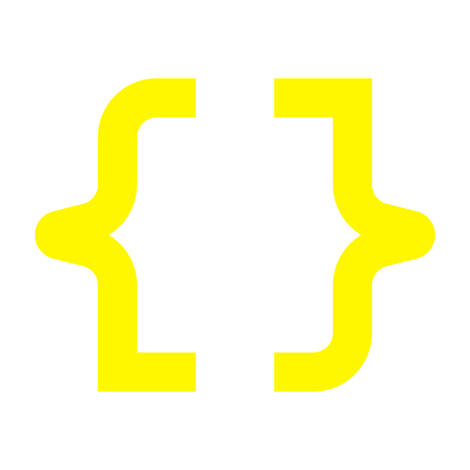

<h1 align="center">
  
</h1>

<h5 align="center">
  <code><a href="https://www.linkedin.com/in/tsuhas/" title="LinkedIn Profile"> LinkedIn</a></code>
  <code><a href="https://www.hackerrank.com/profile/suhasftw" title="HackerRank Profile"> HackerRank</a></code>
  <code><a href="https://www.instagram.com/zenn1._/" title="Instagram Profile"> Instagram</a></code>
</h5>

 

  Hi, I'm Suhas, a CS Enthusiast.
    
  🔬 CS Undergrad
   
  💻 I love writing code and learning about new technologies.
   
  📚 Currently exploring Data Structures and Algorithms & Web Dev
   
  💬 Ask me anything from <a href="https://github.com/heysuhas">here</a>
   
  📫 Reach me at: <a href="mailto:hey.suhas@outlook.in">hey.suhas@outlook.in</a>

<h2 align="center">🔥 Languages, Frameworks & Tools 🔥</h2>

  <code></code>
  <code></code>
  <code></code>
  <code></code>
  <code></code>
  <code></code>
  <code></code>
  <code></code>
  <code></code>
  <code></code>
  <code></code>
  <code></code>
  <code></code>

<h2 align="center">⚡ Stats ⚡</h2>

      
  

 

  
  

